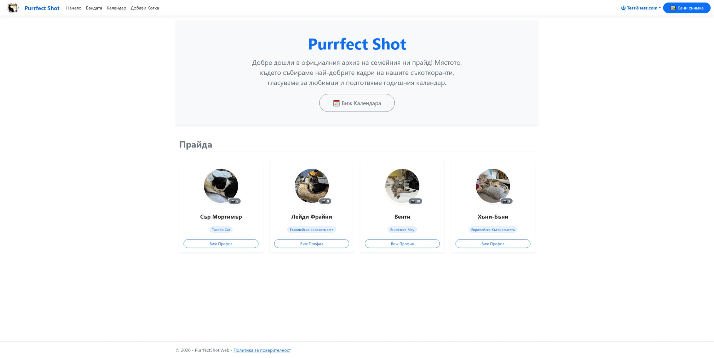
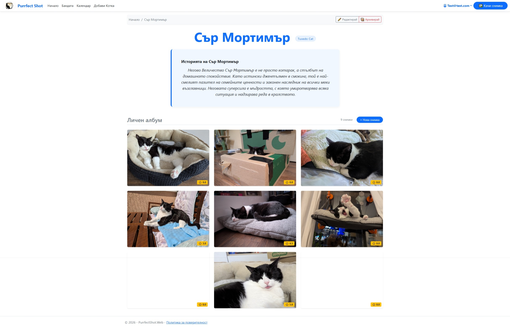
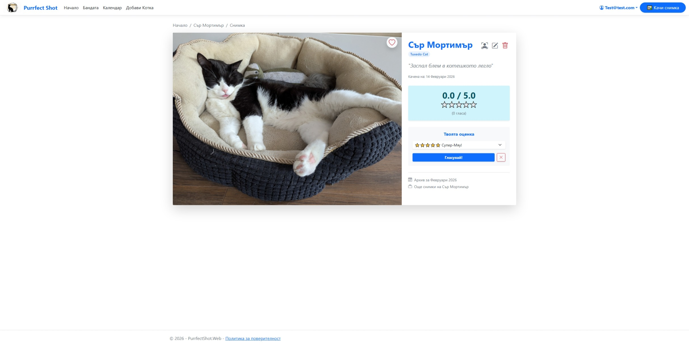

# 📸 PurrfectShot

> A modern family cat photo archive and monthly ranking system designed to organize and celebrate our feline companions.


---

## 📋 Table of Contents

- [About the Project](#about-the-project)
- [Technologies Used](#technologies-used)
- [Prerequisites](#prerequisites)
- [Getting Started](#getting-started)
- [Project Structure](#project-structure)
- [Features](#features)
- [Usage](#usage)
- [Database Setup](#database-setup)
- [Configuration](#configuration)
- [Contributing](#contributing)
- [Contact](#contact)

---

## 📖 About the Project

**Purrfect Shot** is a specialized web platform built for cat-loving households. It solves the problem of scattered family photos by organizing them into a structured monthly calendar. Users can create detailed profiles for their cats, upload memories, and vote for the "Photo of the Month", which automatically becomes the calendar cover.

The application serves as a demonstration of advanced ASP.NET Core concepts, including *N-Tier architecture*, *Secure Identity integration*, and *Custom Data Logic (Soft Delete/Archive)*.

---

## 🛠️ Technologies Used

| Technology            | Version  | Purpose                          |
|-----------------------|----------|----------------------------------|
| ASP.NET Core MVC      | 8.0      | Main Web framework               |
| Entity Framework Core | 8.0      | ORM / Database access            |
| SQL Server            | 2022     | Database (running via Docker)    |
| ASP.NET Identity	    | 8.0	   | Authentication & Authorization   |
| Bootstrap             | 5.3      | Frontend styling                 |
| Razor Pages / Views   | -        | Server-side HTML rendering       |
| jQuery Validation	    | -	       | Client-side form validation      |

---

## ✅ Prerequisites

Before running the project, ensure you have the following:

- [.NET SDK 8.0+](https://dotnet.microsoft.com/download)
- [Visual Studio 2022](https://visualstudio.microsoft.com/) or [VS Code](https://code.visualstudio.com/)
- [SQL Server](https://www.microsoft.com/en-us/sql-server) or [Docker Desktop (for SQL Server Container)](https://www.docker.com/products/docker-desktop/)
- [Git](https://git-scm.com/)

---

## 🚀 Getting Started

### 1. Clone the Repository

```bash
git clone https://github.com/Zarumoth/PurrfectShot.git
cd PurrfectShot
```

### 2. Restore dependencies

```bash
dotnet restore
```

### 3. Apply Database Migration

Open the **Package Manager Console** in Visual Studio, set the Default Project to **PurrfectShot.Data** and run:

```bash
Update-Database -StartupProject PurrfectShot.Web
```

This will create the database and seed it with 4 cat profiles, 36 photos, initial votes, and the admin/test user.

### 4. Run the application

Press **F5** or select **PurrfectShot.Web** as the startup project and click **Start**.
The app will be available at `https://localhost:7194`.

---

## 📁 Project Structure

The solution follows a clean 6-layer **N-Tier architecture**:

```
PurrfectShot/
│
├── PurrfectShot.Web/              # Presentation Layer (Controllers & Views)
├── PurrfectShot.Services.Data/    # Business Logic and Interfaces
├── PurrfectShot.Web.ViewModels/   # InputModels and ViewModels
├── PurrfectShot.Data/             # Data Access (DbContext, Configs, Migrations)
├── PurrfectShot.Data.Models/      # Domain Entities (ApplicationUser, Cat, Photo, Vote)
└── PurrfectShot.Common/           # Shared Constants and Validation helpers
```

---

## ✨ Features

- **N-Tier Architecture** Complete separation of concerns for scalability.  
- **Identity System** Fully localized (Bulgarian) ASP.NET Core Identity.  
- **Smart Archive** "Soft delete" cat profiles while preserving photo history.  
- **Photo Management** Upload/Delete with physical file cleanup on the server.  
- **Dynamic Calendar** Automatic monthly grouping with Bulgarian localization.  
- **Voting System** Seamless "Upsert" voting logic with "Unvote" capability.  
- **User Favorites** Many-to-Many relationship for personal collections.  
- **Security** GUID-based identifiers for photos to prevent ID scraping.  
- **Comprehensive Seeding** Ready-to-use data for 4 cats and 36 photos.  

## 💻 Usage

### 🏠 Explore & Navigate

- **Home Page**: Check the "Hero" section for global stats and browse the "Pride" section to see all active cat residents.
- **The Band (Cats)**: Visit the full list of cats via the "Бандата" (The Band) link in the navigation.



### 🗓️ Monthly Calendar

- Navigate to **Calendar**.
- Browse the archive by month/year covers.
- Click on a specific month to view the full gallery of uploaded photos, sorted by rating.

### 🐈 Profiles & Photos

- **Cat Details**: Click on any cat card to view their bio, breed info, and personal photo album.
- **Photo Details**: Click on any photo to see it in full size. Here you can see the rating, upload date, and navigation buttons.




### 🗳️ Interaction (Login Required)

- **Register/Login**: Create an account to unlock interactive features.
- **Vote**: Rate photos from 1 to 5 stars. You can change your vote anytime (Seamless Upsert).
- **Favorites**: Click the Heart icon ❤️ on a photo to add it to your personal "Favorites" collection.
- **My Photos**: View all photos uploaded by you in your personal dashboard.

### ⚙️ Management (CRUD)

- **Add Cat**: Use the "Add Cat" button to introduce a new member to the household.
- **Upload Photo**: Upload new memories via the "Upload" button. You can assign the photo to a specific cat.
- **Edit/Delete**:
	- Manage cat profiles (Edit details or Archive them).
	- Manage photos (Edit captions or Delete permanently).
	- Note: Archiving a cat hides it from the main lists but preserves its photos in history.

### 🧪 Test Account Credentials

To test administrative features, use the seeded account:
- **Email**: admin@purrfect.com
- **Password**: Admin123!

**Note**: Currently, the system allows all registered users to perform CRUD operations (Family mode).

---

## 🗄️ Database Setup

The project uses **Entity Framework Core** with a Code-First approach and **Fluent API** for all relationships.
The project is configured to run with **SQL Server in a Docker Container**.

**Option 1: Docker (Recommended)**
Ensure your Docker container is running and exposed on port **1433**.

The connection string is configured in appsettings.json:
Connection string is configured in `appsettings.json`:

```json
"ConnectionStrings": {
  "DefaultConnection": "Server=localhost,1433;Database=PurrfectShotDb;User
  Id=sa;Password=SoftUniTestDb1423!;TrustServerCertificate=True;MultipleActiveResultSets=true"
}
```

**Option 2: Local SQL Express**
If you prefer a local installation, update the connection string to:

```json
"ConnectionStrings": {
  "DefaultConnection": "Server=
  (localdb)\\mssqllocaldb;Database=PurrfectShotDb;Trusted_Connection=True;MultipleActiveResultSets=true"
}
```

**Note**: You can aso use your desired [SQL Connection](https://www.connectionstrings.com/sql-server/)

---

## ⚙️ Configuration

The application uses standard `.NET` configuration. No additional API keys are required for local development.

`appsettings.json` structure:

```json
{
  "ConnectionStrings": {
    "DefaultConnection": "..."
  },
  "Logging": {
    "LogLevel": {
      "Default": "Information",
      "Microsoft.AspNetCore": "Warning"
    }
  },
  "AllowedHosts": "*"
}
```

---

## 🤝 Contributing

Contributions are welcome! To contribute:

1. Fork the repository.
2. Create a new branch: `git checkout -b feature/AmazingFeature`
3. Commit your changes: `git commit -m "Add some AmazingFeature"`
4. Push to the branch: `git push origin feature/AmazingFeature*`
5. Open a Pull Request.

---

## 📄 License

This project is licensed under the **MIT License**. See the [LICENSE](LICENSE.txt) file for details.

---

## 📬 Contact

**Zarumoth** – [@Zarumoth](https://github.com/Zarumoth)

Project Link: [https://github.com/Zarumoth/PurrfectShot](https://github.com/Zarumoth/PurrfectShot)

---

*Built as part of the **ASP.NET Fundamentals** course.*


